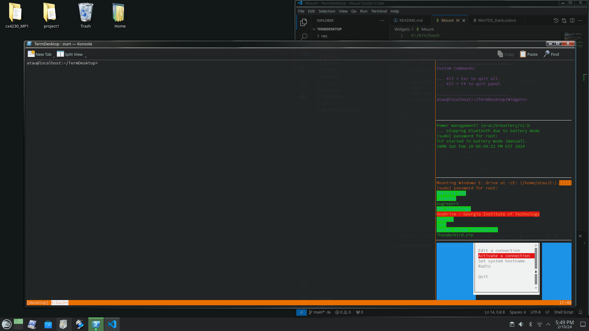
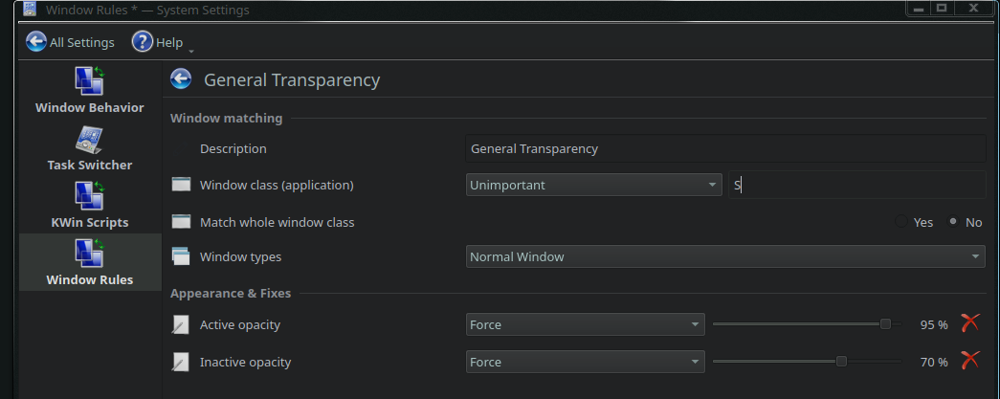

# Term Desktop
- 
- This is a collection of scripts and themes I use on my Open SUSE + KDE desktop
- Sections below go over installation / usage of different components

## Text Mode Booting
- In `/boot/grub2` backup the `grub.cfg` file as something like `grub.cfg.bak`
- In `/etc/grub.d` find `10_linux`, this entry is a Bash script that generates linux entries for Grub 2
    - Back up this file in a new `bak` folder within `/etc/grub.d`
    - Edit the original `10_linux` file...
        1. There is usually a `is_top_level ... linux_entry ...` section at the bottom
        2. Copy the linux entry call, and past one immediately below
        3. Add some prefix/suffix around first parameter, which should just be `${OS}` in the beginning. This names the title of your new boot target
        4. Add `3` after `${GRUB_CMDLINE_LINUX_DEFAULT}`. This switches the boot target to text mode instead of graphical
- Run `sudo grub2-mkconfig -o /boot/grub2/new.cfg`
    - Check that `new.cfg` has entries that "make sense", rename it to `grub.cfg` and reboot to check that a new boot target has been added

## Color Scheme
- Copy the `.colors` file into `~/.local/share/color-schemes/`, restart and check appearance
- Edit the theme in appearance settings then save

# Other Theming Used
- Global Theme: OpenSUSE
- Application Style: Fusion
- Plasma Style: OpenSUSE
- Colors: [custom](Win7OS_Dark.colors)
- Window Decorations: Aero-Vidrio (WVista)
- Icons: WVista
- Cursors: WindowsVista
- SplashScreen: None
- Wall Paper: (some pure color)
- Window transparency rule:
    - 